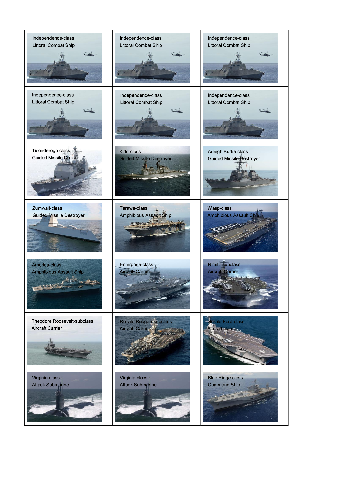
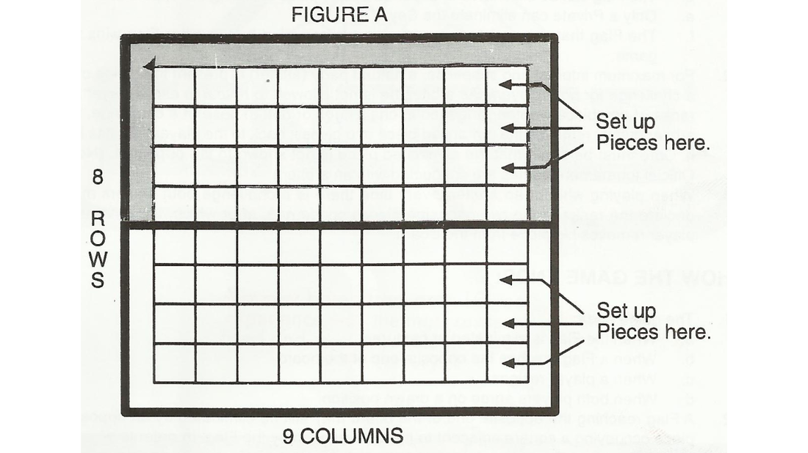
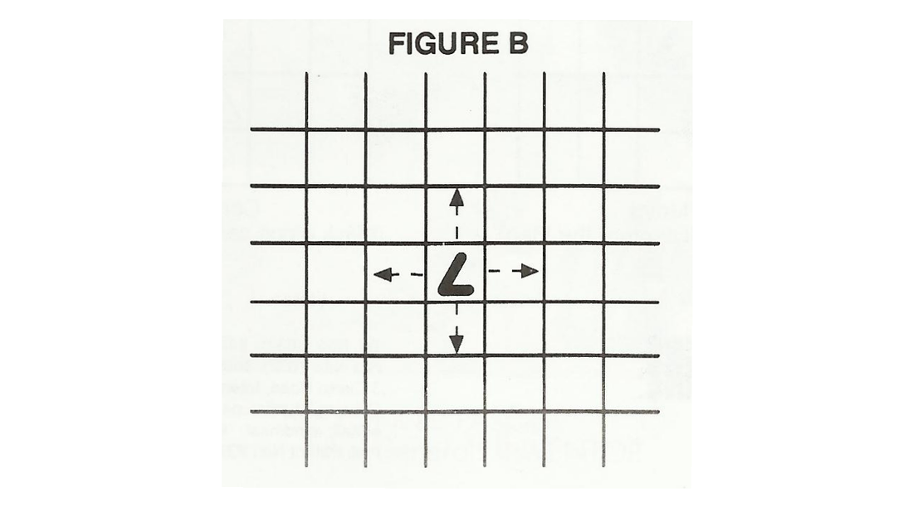

# Command of the Sea

Command of the Sea is a turn-based strategy game based on Dover Patrol (Gibson, 1911) and Game of the Generals (Pasola, 
1970).

## Objective

The objective of the game is to eliminate or capture the Command Ship of your opponent. You may also win by successfully
maneuvering your own Command Ship to the opposite end of the board.

## Pieces

The player's set of pieces or ships with the corresponding classes and functions consists of the following 21 pieces:

Piece                                         | Total | Function
--------------------------------------------- | ----- | --------
Gerald Ford-class Aircraft Carrier            | 1     | Eliminates any lower-class ship including the Littoral Combat Ship and the Command Ship
Ronald Reagan-subclass Aircraft Carrier       | 1     | Eliminates any lower-class ship including the Littoral Combat Ship and the Command Ship
Theodore Roosevelt-subclass Aircraft Carrier  | 1     | Eliminates any lower-class ship including the Littoral Combat Ship and the Command Ship
Nimitz-subclass Aircraft Carrier              | 1     | Eliminates any lower-class ship including the Littoral Combat Ship and the Command Ship
Enterprise-class Aircraft Carrier             | 1     | Eliminates any lower-class ship including the Littoral Combat Ship and the Command Ship
America-class Amphibious Assault Ship         | 1     | Eliminates any lower-class ship including the Littoral Combat Ship and the Command Ship
Wasp-class Amphibious Assault Ship            | 1     | Eliminates any lower-class ship including the Littoral Combat Ship and the Command Ship
Tarawa-class Amphibious Assault Ship          | 1     | Eliminates any lower-class ship including the Littoral Combat Ship and the Command Ship
Zumwalt-class Guided Missile Destroyer        | 1     | Eliminates any lower-class ship including the Littoral Combat Ship and the Command Ship
Arleigh Burke-class Guided Missile Destroyer  | 1     | Eliminates any lower-class ship including the Littoral Combat Ship and the Command Ship
Kidd-class Guided Missile Destroyer           | 1     | Eliminates any lower-class ship including the Littoral Combat Ship and the Command Ship
Ticonderoga-class Guided Missile Cruiser      | 1     | Eliminates the Littoral Combat Ship and the Command Ship
Independence-class Littoral Combat Ship       | 6     | Eliminates the Attack Submarine and the Command Ship
Blue Ridge-class Command Ship                 | 1     | The Command Ship can be eliminated by any piece including the opposing Command Ship; a Command Ship eliminates the opposing Command Ship when it takes aggressive action by moving into the same square occupied by the other Command Ship
Virginia-class Attack Submarine               | 2     | Eliminates all ships including the Command Ship except the Littoral Combat Ship

NOTE: If both ships are of equal classes, BOTH are eliminated.

## Preparation

Spread out the board as illustrated in Figure A. Arrange your respective sets of pieces on the first three (3) rows on
your end of the board with the printed sides facing you. (See Figure A). There is no predetermined place for any piece.
You are therefore free to arrange the pieces according to your strategy of style of play. Note that as you arrange your
pieces on the first three (3) rows, you will find six (6) vacant squares. This is to allow for maneuvering and freedom
of movement when play begins.

 
## Movement

1. Any player makes the first move. Players move alternately. 
2. A player can move only one piece at a time.
3. A move consists of pushing a piece to an adjacent square, either forward, backward or sideward. A diagonal move or a
move of more than one square is illegal. (See Figure B)

## Challenging

1. As the game progresses, challenges are made resulting in the elimination of ships. A "challenge" is made when a ship
moves into the same square occupied by an opposing ship. When a challenge is made the following rules of elimination
apply:

   a. A higher-class ship eliminates from the board a lower-class ship.
   
   b. If both ships are of equal class, both are eliminated.
   
   c. An Attack Submarine eliminates any ship starting with the Gerald Ford-class Aircraft Carrier down to the
    Ticonderoga-class Guided Missile Cruiser.
    
   d. The Command Ship can be eliminated or captured by any piece including the opponent's Command Ship.
   
   e. Only a Littoral Combat Ship can eliminate the Attack Submarine.
   
   f. The Command Ship that moves into the same square occupied by the other Command Ship wins the game. 

2. For maximum interest and suspense, a natural party (arbiter) is present to preside over a challenge for both players.
As arbiter, he is not allowed to reveal to either player the ships whether engaged in challenges or not. In case of a
challenge, the arbiter quietly removes the outclassed piece and gives it back to the player who has lost it. Care must
be made that the eliminated piece is not shown to the opponent. (Note: Official tournament games are conducted with an
arbiter.) 

3. When playing without an arbiter, every time there is a challenge both players must declare the classes of the two
opposing pieces concerned, after which, the outclassed player removes his piece from the Board. 

## Game Over

1. The game ends:

   a. When the Command Ship is eliminated or captured.
   
   b. When a Command Ship reaches the opposite end of the board.
   
   c. When a player resigns.
   
   d. When both players agree on a drawn position.

2. A Command Ship reaching the opposite end of the board may still be eliminated by an opposing piece occupying a square
adjacent to the one reached by the Command Ship. To win, the Command Ship should be at least two squares away or ahead
of any opposing piece.

## Features

1. API's exposed via Amazon API Gateway
2. API's integrated with AWS Lambda
3. Players and matches stored in Amazon DynamoDB
4. Passwords are hashed using scrypt
5. React Web interface

## Upcoming Features

1. Email notifications via Amazon SES
2. Chat with opponent
3. Tournaments
4. React Mobile interface
5. Play against AI
